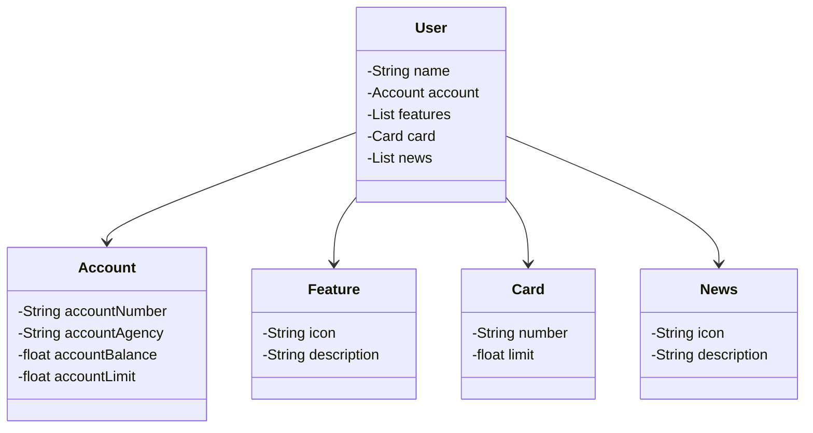

# Santander Dev Week 2023
projeto de estudos DIO

## Diagrama de classes 

```mermaid

classDiagram
    class User {
        -String name
        -Account account
        -List<Feature> features
        -Card card
        -List<News> news
    }

    class Account {
        -String accountNumber
        -String accountAgency
        -float accountBalance
        -float accountLimit
    }

    class Feature {
        -String icon
        -String description
    }

    class Card {
        -String number
        -float limit
    }

    class News {
        -String icon
        -String description
    }

    User --> Account
    User --> Feature
    User --> Card
    User --> News

```
